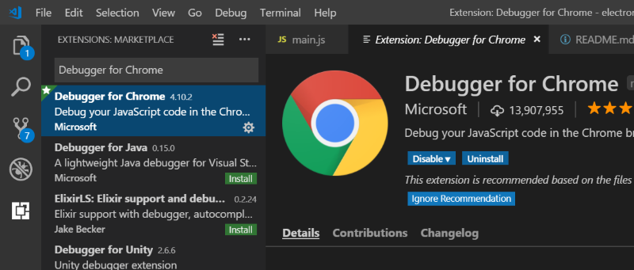
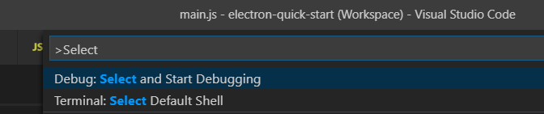
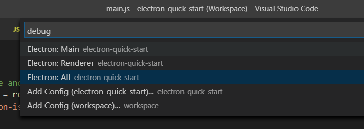

# Noseratio's version of `electron-quick-start`

This is a fork of **[Minimal Electron Application](https://github.com/electron/electron-quick-start)** to which I added some minimal IPC between Main and Renderer processes, as well as some debugging support based on the **[Electron Debugging (Main and Renderer Process)](https://github.com/Microsoft/vscode-recipes/tree/master/Electron)** VSCode recipe.

It uses promises and `async/await` extensively throughout the [Main](https://github.com/noseratio/electron-quick-start/blob/master/main.js) and [Renderer](https://github.com/noseratio/electron-quick-start/blob/master/renderer.js) initialization scripts. This provides some nice pseudo-synchronous, pseudo-linear code flow, which facilitates error handling and is easy to step through and debug.

There's some logic to delay the execution of the scripts inside the Renderer process, to give Chrome Debugger some extra time to initialize and attach to the Renderer. Without it, I was unable to hit some breakpoints I set inside the Renderer. Apparently, I am not the only one experiencing this issue, e.g., here's [a similar question on SO](https://stackoverflow.com/questions/52844870/debugging-electron-renderer-process-with-vscode).

## How to run it

To clone and run this repository you'll need [Git](https://git-scm.com) and [Node.js](https://nodejs.org/en/download/) (which comes with [npm](http://npmjs.com)) installed on your computer. I tested this project under Windows, where I usually install everything with [Chocolatey](https://chocolatey.org/) from admin PowerShell, e.g.: 

```powershell
choco install nodejs
```
Then from your shell command line:

```powershell
# Clone this repository
git clone https://github.com/noseratio/electron-quick-start.git
# Go into the repository
cd electron-quick-start
# Install dependencies
npm install
# Run the app
npm start
```
## How to debug it with Visual Studio Code (both Main and Renderer):

- First, install VSCode:<br>`choco install vscode`<br>
  You may need to restart the shell for the `PATH` environment changes to be picked up.
- Go to the project folder and run:<br>`code electron-quick-start.code-workspace`
- In VSCode, make sure Debugger for Chrome extension is installed. 
  Go to Extensions (<kbd>Ctrl+Shift+X</kbd>) and type *Debugger for Chrome*, then install it:<br>
  
- Set breakpoints in `master.js` and `renderer.js` as desired with <kbd>F9</kbd>.<br>
  **Don't hit <kbd>F5</kbd> just yet!**
- Go to Commands (<kbd>Ctrl+Shift+P</kbd> or <kbd>F1</kbd>) and type *Select and Start Debugging*:<br>
  
- Choose *Electon: All*:<br>
  
- That should start a debugging session for both Main and Renderer processes. You should be able to hit all breakpoints inside `main()` functions inside `main.js` and `renderer.js`. The selected configuration is remembered, so next time you could just hit <kbd>F5</kbd>.

## License

[CC0 1.0 (Public Domain)](LICENSE.md)
